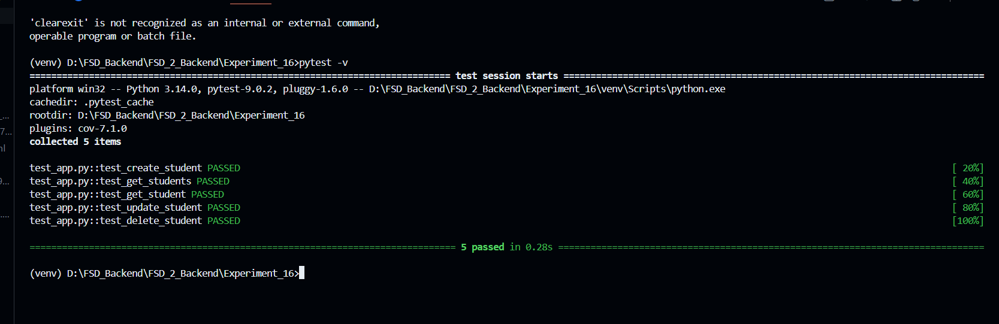
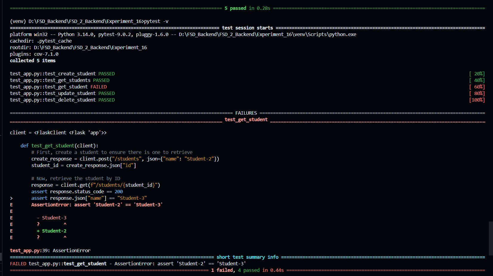
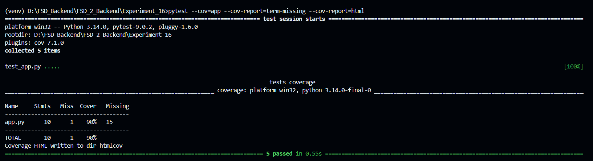
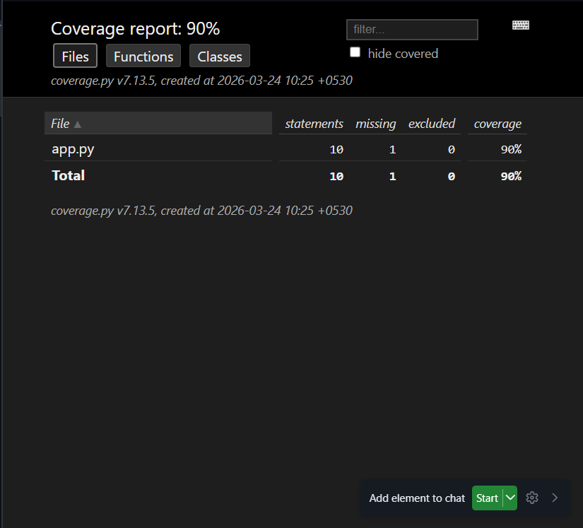
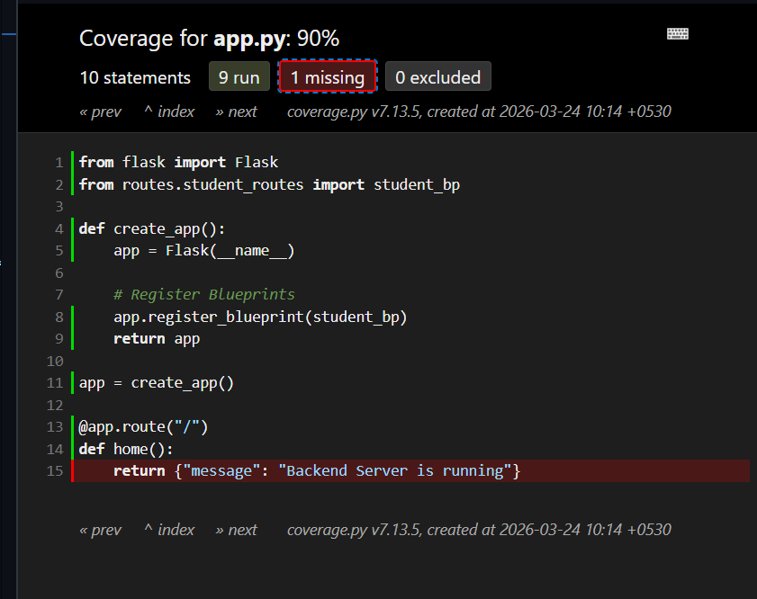

### Experiment No. 16: Perform Unit Testing for Frontend & Backend Modules

## Aim

To implement unit testing for backend APIs using Flask and Pytest, and understand frontend unit testing concepts using JavaScript testing frameworks.

## Theory

### Importance of Testing

- Improves reliability of applications
- Prevents regressions after updates
- Ensures correct functionality of code

### Types of Testing

- Unit Testing
- Integration Testing
- System Testing
- Acceptance Testing

### Backend Testing (Flask)

Flask provides a test client that allows simulation of HTTP requests without running the server.

## ⚙️ Technologies Used

- Python
- Flask
- Pytest
- Pytest-Cov
- Virtual Environment (venv)

## Procedure

### Backend Testing (Flask + Pytest)

1. Install dependencies:

```bash
pip install pytest
```

2. Create Flask API endpoint:

```python
@app.route("/add")
def add():
    a = int(request.args.get("a"))
    b = int(request.args.get("b"))
    return {"result": a + b}
```

3. Write test cases:

```python
def test_add(client):
    response = client.get("/add?a=2&b=3")
    assert response.status_code == 200
    assert response.json["result"] == 5
```

4. Run tests:

```bash
pytest -v
```

---

### Frontend Testing (Concept)

```javascript
function add(a, b) {
  return a + b;
}

test("adds numbers", () => {
  expect(add(2, 3)).toBe(5);
});
```

## 📁 Project Structure

```
Experiment_16/
├── routes/
│   └── student_routes.py
├── Screenshots/
├── venv/
├── app.py
├── run.py
├── test_app.py
├── requirements.txt
└── README.md
```

---

## How to Run the Project

```bash
python -m venv venv
venv\Scripts\activate
pip install -r requirements.txt
python run.py
```

Server runs at:

```
http://localhost:5000
```

---

## API Endpoints

| Method | Endpoint       | Description       |
| ------ | -------------- | ----------------- |
| POST   | /students      | Create student    |
| GET    | /students      | Get all students  |
| GET    | /students/<id> | Get student by ID |
| PUT    | /students/<id> | Update student    |
| DELETE | /students/<id> | Delete student    |

---

## Running Tests

```bash
pytest -v
```

---

## Code Coverage

```bash
pytest --cov=app --cov-report=term-missing --cov-report=html
```

Open HTML report:

```
htmlcov/index.html
```

---

## Screenshots

### Server Running



### All Tests Passed



### Failed Test Case



### Coverage Report (Terminal)



### Coverage Report (HTML)



## Learning Outcomes

- Understood unit testing for backend APIs using Flask
- Learned how to write and execute test cases using Pytest
- Gained knowledge of debugging techniques in Python
- Learned importance of code coverage and test automation
- Understood frontend testing concepts using Jest
- Improved understanding of software testing lifecycle