# 23BIS70042 - RAVINA PATEL
# Frontend Performance Analysis Using Browser Developer Tools (Microsoft Edge)

## 1. Aim
To analyze and evaluate frontend performance of a web application using Developer Tools and identify optimization opportunities such as Microsoft Edge Developer Tools.

## 2. Learning Objectives
- Understand frontend performance metrics
- Analyze network requests and API calls
- Measure rendering and interaction performance
- Use Lighthouse for performance auditing
- Simulate real-world network conditions
- Identify optimization techniques

## 3. Theory
Frontend performance refers to how quickly a web page loads, renders, and responds to user interactions. Key factors include network latency, JavaScript execution, rendering time, and third-party scripts.

Microsoft Edge DevTools (Chromium-based) provide comprehensive tools such as:
- Elements
- Network
- Performance
- Memory
- Lighthouse

These tools help developers debug, analyze, and optimize web applications efficiently.

## 4. Key Performance Metrics

| Metric | Description |
|------|------------|
| FCP | First Contentful Paint |
| LCP | Largest Contentful Paint |
| CLS | Cumulative Layout Shift |
| INP | Interaction to Next Paint |
| TTI | Time to Interactive |
| API Latency | Backend response time |

## 5. Tools Used
- Microsoft Edge Browser
- Edge Developer Tools
- Network Panel
- Performance Panel
- Memory Panel
- Lighthouse

## 6. Step-by-Step Procedure

### 6.1 Opening DevTools
- Open website (https://www.google.com)
- Right click → Inspect
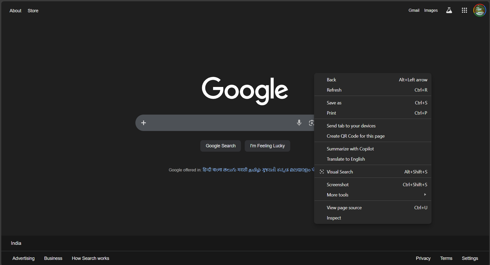
- OR Press F12
- Edge Developer Tools will open 
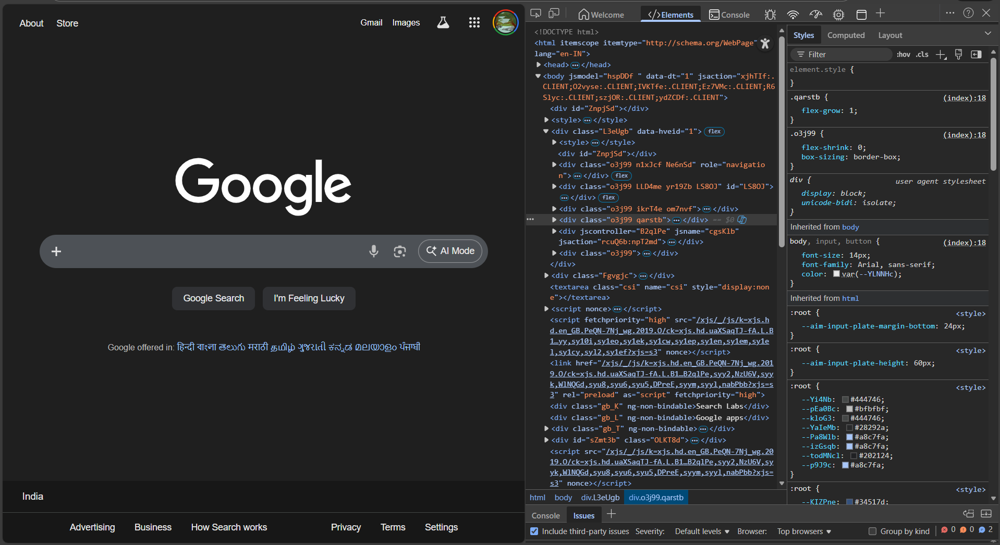

### 6.2 Network Analysis (No Throttling)
- Open Network tab
- Reload page
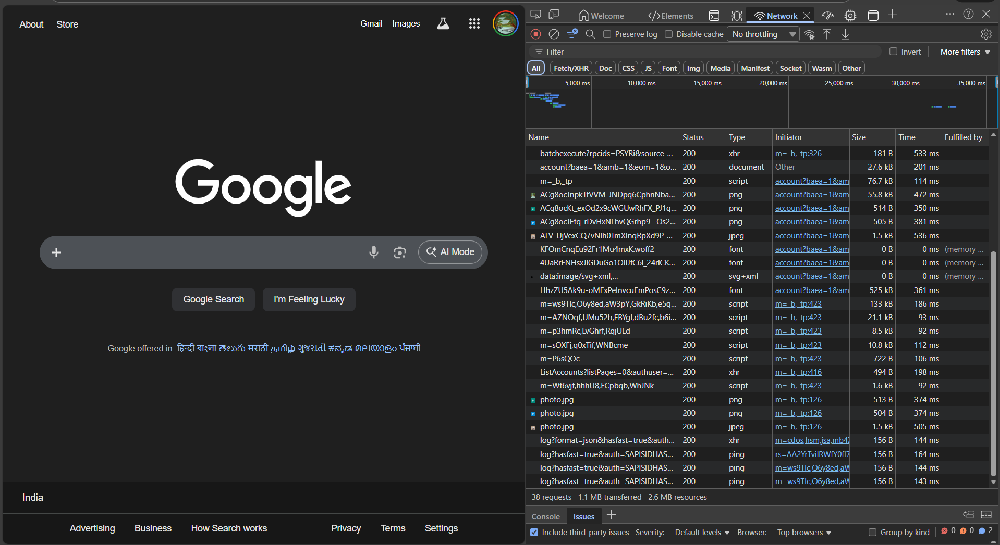

### 6.3 Elements Inspection
- Inspect DOM structure
- Analyze JS, XHR, images, fonts, API Calls
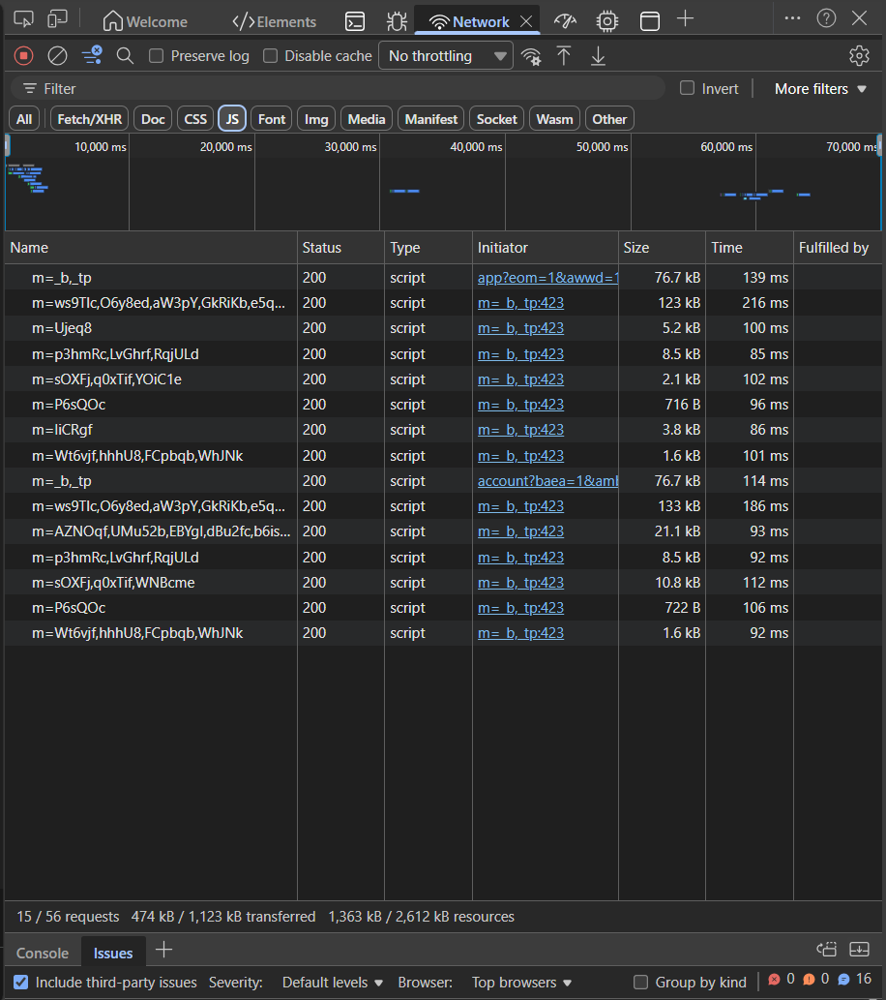
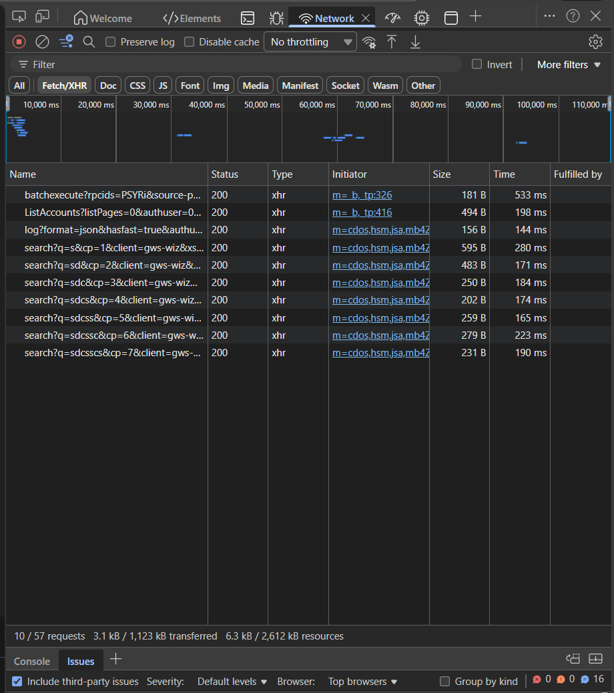

### 6.4 Core Web Vitals
- Observe LCP, CLS, INP metrics
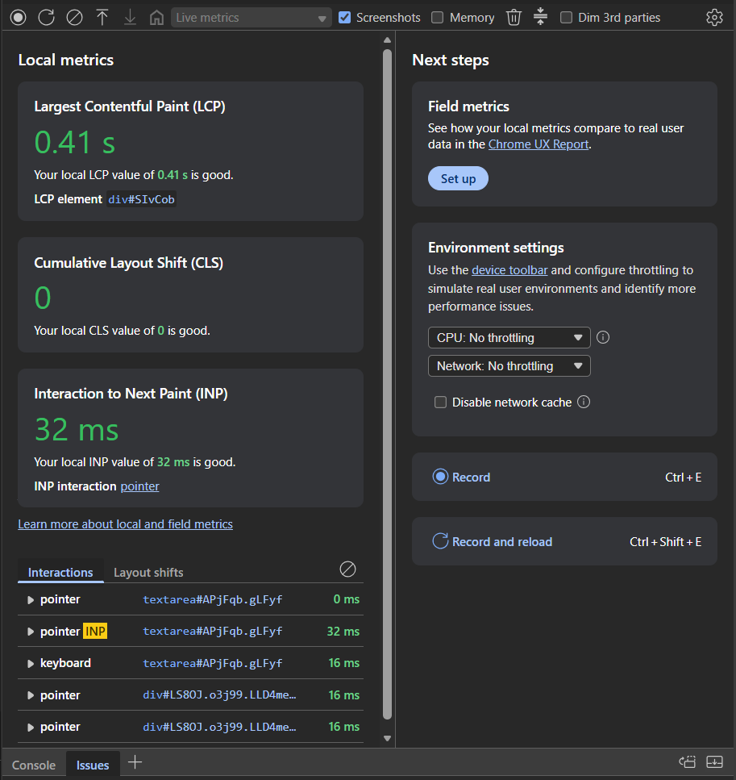

### 6.5 Performance Recording
- Open Performance tab
- Click Record → Reload page
- Analyze main thread, scripting, rendering
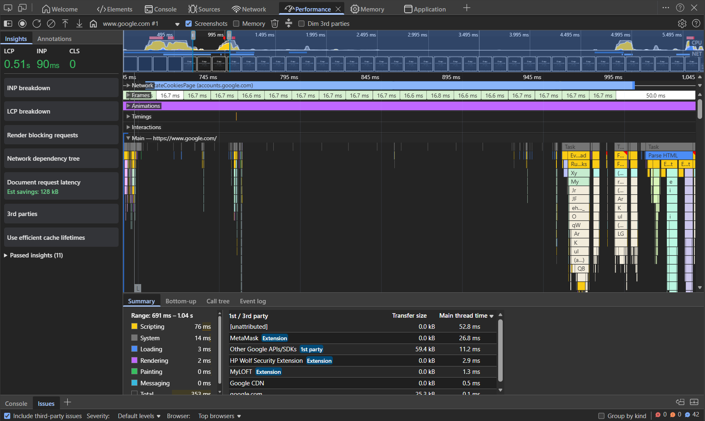

### 6.6 Lighthouse Audit
- Open Lighthouse tab
- Run audit (Desktop)
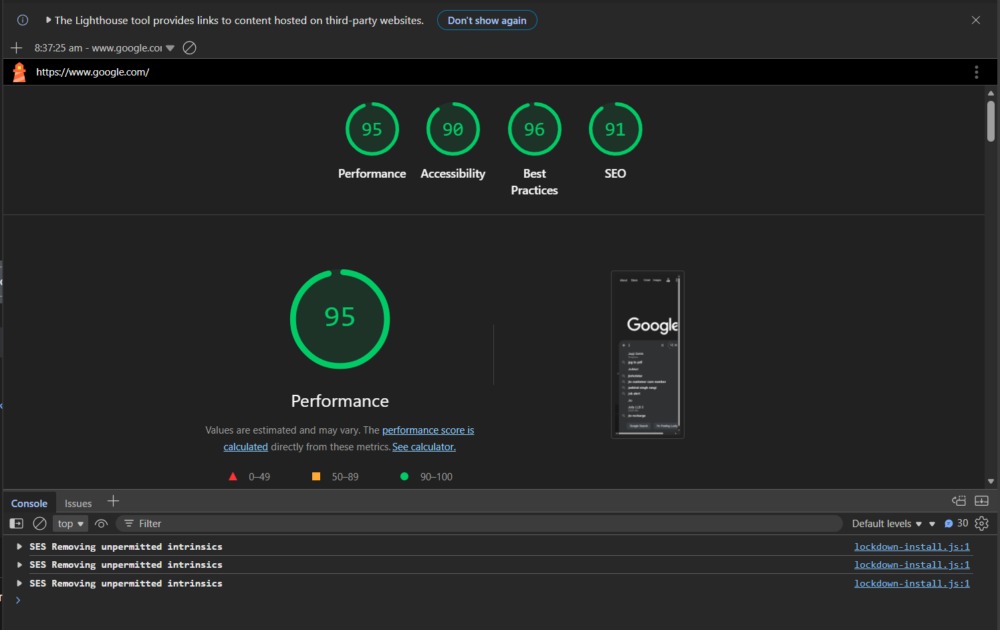
Performance Score: 95  
Accessibility: 90  
Best Practices: 96  
SEO: 91  

### 6.7 Network Throttling (3G Simulation)
- Change Network to 3G
- Reload page
- Observe delayed loading
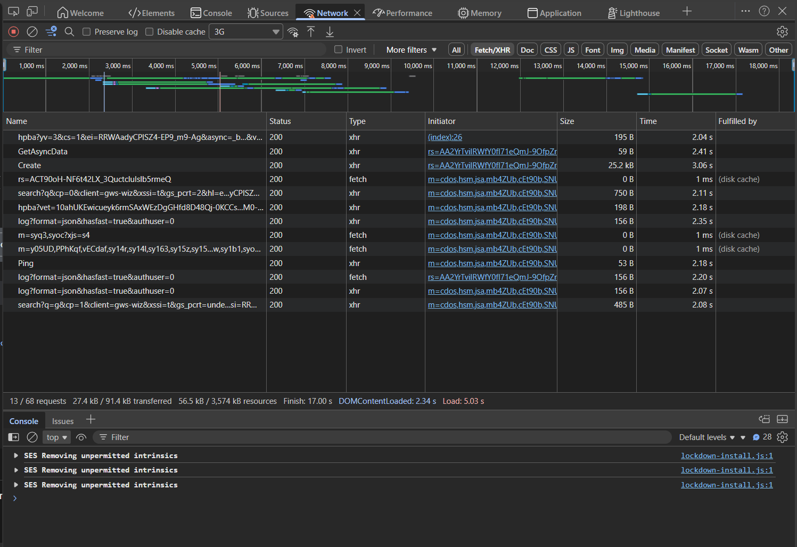

### 6.8 Disable Cache Test
- Enable Disable Cache
- Reload page
- Compare load times
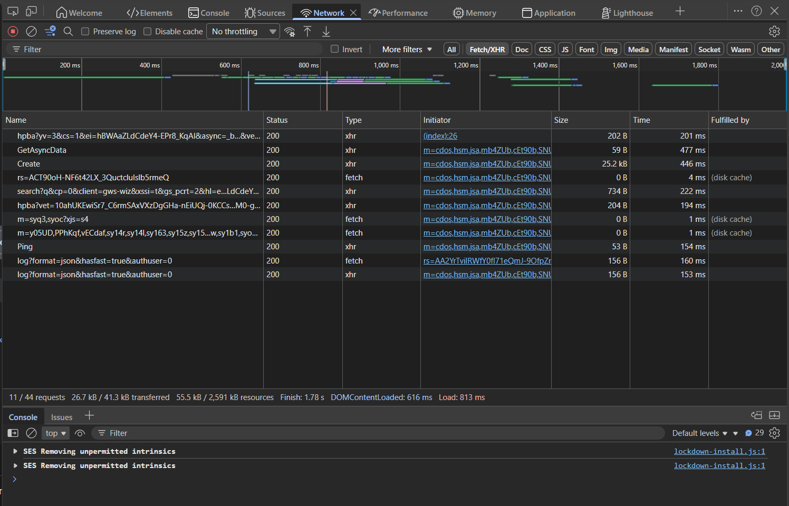
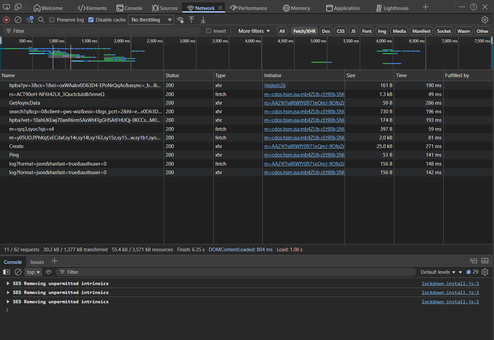

### 6.9 Memory Analysis
- Open Memory tab
- Take Heap Snapshot
- Observe memory usage
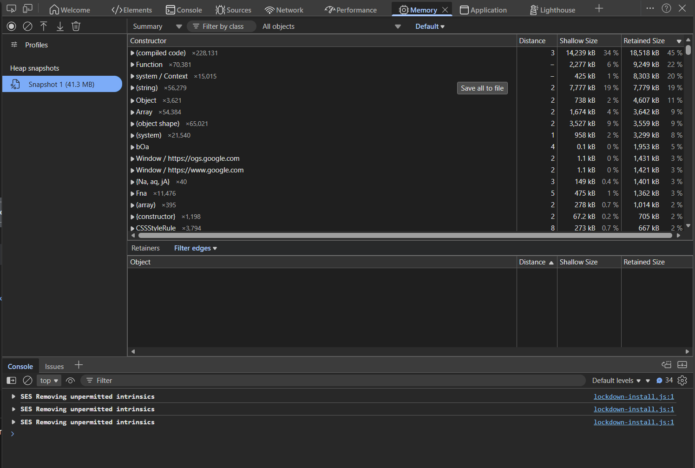

### 6.10 Sources Tab
- View loaded scripts and source mapping

## Learning Outcome
- Learnt about Browser Developer Tools & it's components.
- Learnt to observe website network under different situation.
- Learnt about memory analysis, devtools.
- Learnt about how cache helps in reducing website loading
- Learnt about network different terms