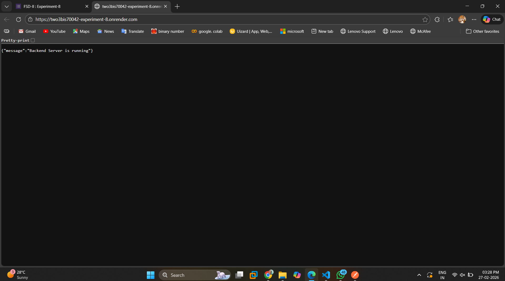
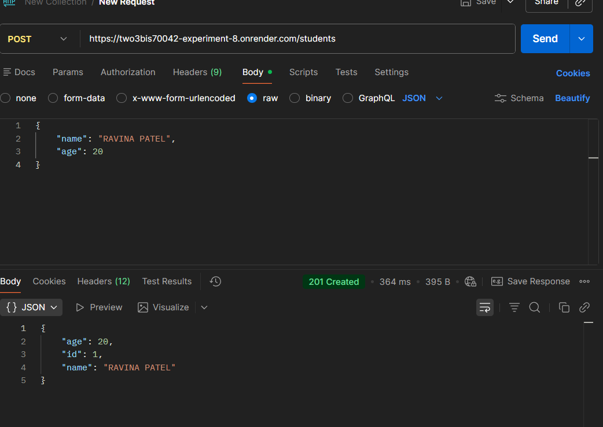
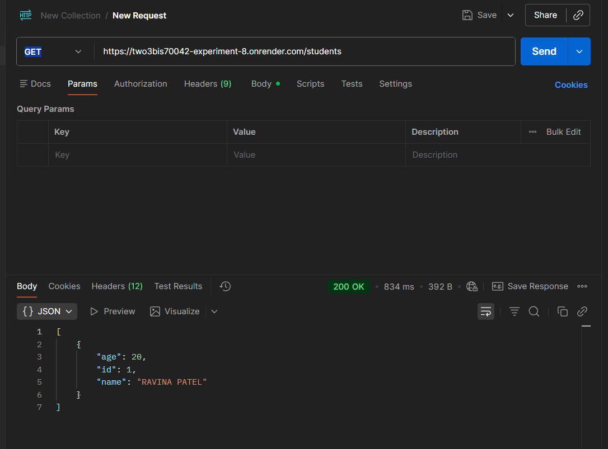
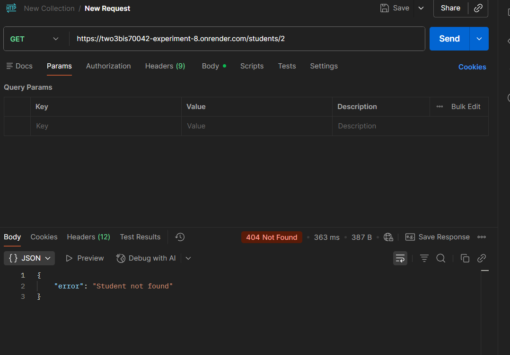
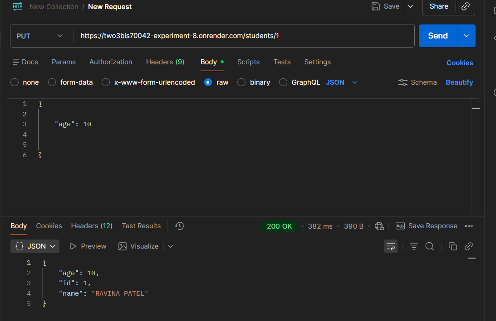
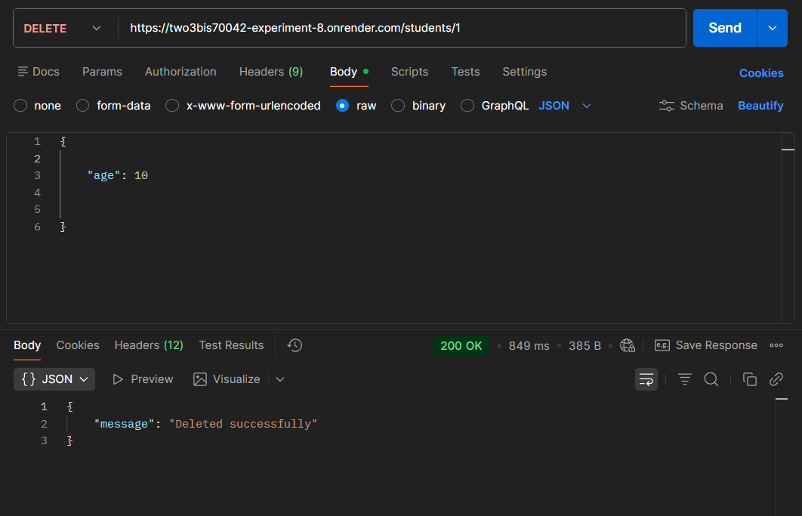

## Experiment No. 8 - Develop RESTful APIs using Backend Framework (Flask)

### Project Structure

```bash
Experiment_8/
├── routes/
│   └── student_routes.py
├── venv/
│   ├── Include/
│   ├── Lib/
│   └── Scripts/
├── requirements.txt
├── app.py
├── run.py
└── README.md
```

### Technologies Used

- Python
- Flask
- REST API
- Postman
- Render (Cloud Deployment)
- Virtual Environment (venv)

### Deployment Base URL --> [Render Link](https://two3bis70035-experiment-8.onrender.com)


## STEPS & SCREENSHOTS
### 1. Server Running

Flask development server successfully started.

### 2. CREATE Student (POST)


### 3. READ ALL Students (GET)


### 4. READ ONE Student
### GET Student ID = 1


### 5. UPDATE Student (PUT)


### 6. DELETE Student



## API Endpoints Summary
| Method | Endpoint | Description |
|--------|----------|------------|
| POST   | /students | Create new student |
| GET    | /students | Get all students |
| GET    | /students/<id> | Get student by ID |
| PUT    | /students/<id> | Update student |
| DELETE | /students/<id> | Delete student |

## Learning Outcome
- Learnt about backend technologies
- Learnt to create virtual enviroment of python using venv
- Learnt about flask in python
- Learnt about RESTful APIs
- Learnt to route in flask